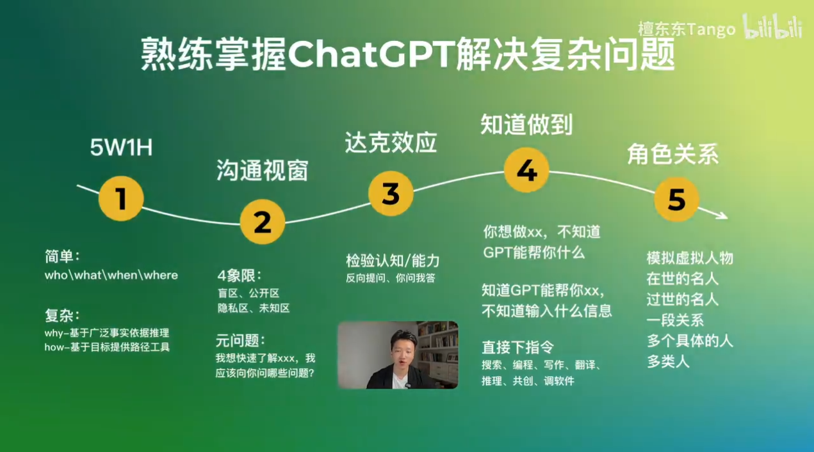

# 提问句式整理

## 你不知道，GPT知道

1. 元问题：我想了解xxxx，我应该向你问哪些问题？
2. 请给我列出xxx领域/行业相关的，最常用的50个概念，并做简单解释。如果有英文缩写，请给出完整的英文解释。
3. 请详细介绍一下elon musk的主要生平事迹。请详细介绍一下tesla这家企业的发展历程。

## 你知道，GPT也知道

### 检验认知

1. 对于xxx主题/技能，你认为哪些是我必须理解和掌握的核心要点？
2. 我理解的xxx是这样的，你觉得我的理解对吗？
3. 我对xxx有一些想法，你能帮我批判性地分析一下这些想法的优点和缺点吗？
4. 我正在考虑xxx的决定，你能帮我分析一下可能的结果和影响吗？

### 扩充认知

1. 我知道xxx的概念，我想知道更多关于xxx的信息。
2. 我在xxx问题上遇到困难，你能提供一些可能的解决方案或建议吗？
3. 我想要深入学习xxx，你能推荐一些进阶的学习资源或学习路径吗？
4. 我想要在xxx领域有所创新，你能提供一些启发或想法吗？
5. 我想在xxx领域提升自己，你能根据最新的研究和趋势给我一些建议吗？
6. 我正在考虑学习xxx，你能给我一些关于这个领域未来发展的观点吗？
7. （背景信息xxx），我要做关于xxx的研究，我认为原因是，还有其他可能的原因吗？给出一些可能的研究假设。 
8. 我是一个xx新手，马上要采访这个行业的资深大佬，我应该向他请教哪些有价值的问题？

## 你知道，GPT不知道

介绍背景现象之后可以向gpt发问，你怎么看待这种现象？可能的原因有哪些？这会对xxx产生什么样的影响？你觉得xxx应该怎么做？

## 你和GPT都不知道

如果xxx，这对社会会产生什么影响？

## 检验自己认知/能力水平提问句式

1. 为了测试我对xxx的理解程度，你会问我什么问题来检验我的水平，最少10个。
2. 我是xx领域的专家，你会问我哪些问题来检验我的专业水平？
3. 追问一句，这些我都懂，还有更专业更细更深的问题吗？
4. 你问我答的游戏

扩展自己能力边界的提问句式我已经很精通xxx了，我想知道我是否还有需要学习的地方？然后不停的问，还有呢还有呢？

## 让GPT完成具体任务

1. 我想做xxx，你能给我提供什么帮助？
2. 我想要你做xxx，我应该给你输入什么信息？
3. 直接下指令

## GPT建议

1. **明确具体**：  
   - 较差的提问：`告诉我关于数学的东西。`
   - 较好的提问：`请解释什么是线性代数中的行列式。`

2. **限定上下文**：  
   - 较差的提问：`为什么苹果会掉下来？`
   - 较好的提问：`根据牛顿的引力理论，为什么苹果会从树上掉下来？`

3. **避免过于开放式的问题**：  
   - 较差的提问：`历史是怎样的？`
   - 较好的提问：`请描述19世纪中期的欧洲工业革命的主要影响。`

4. **明确要求详细程度**：  
   - 较差的提问：`谈谈太阳能。`
   - 较好的提问：`请给我一个关于太阳能板工作原理的简短概述。`

5. **使用关键词**：  
   - 较差的提问：`我想知道那个关于天空的事情。`
   - 较好的提问：`请解释为什么天空是蓝色的。`

6. **针对性地寻求建议或建议**：  
   - 较差的提问：`我应该怎么做？`
   - 较好的提问：`我想提高我的时间管理技巧，你有什么建议吗？`

7. **如果需要复杂的计算或深入的研究，明确指出**：  
   - 较差的提问：`告诉我关于黑洞的一些事情。`
   - 较好的提问：`能否计算一个质量为10倍太阳质量的黑洞的霍金辐射？`

8. **提供必要的上下文或背景**：  
   - 较差的提问：`这个方程式怎么解？`
   - 较好的提问：`我在学习二次方程，不明白怎么解这个方程式 \( ax^2 + bx + c = 0 \)。你能帮我解释吗？`

### 一、基础查询

- **定义和解释**
  - `什么是[关键词]？`
  - `请解释一下[关键词]的意思。`

- **历史和背景**
  - `谈谈[关键词]的历史背景。`
  - `请问[关键词]是如何发展起来的？`

- **操作与步骤**
  - `如何进行[操作]？`
  - `请教我如何实现[任务]？`

### 二、深入探讨

- **对比分析**
  - `请比较[关键词1]和[关键词2]的区别。`
  - `在[场合或条件]下，[关键词1]与[关键词2]哪个更优？`

- **原因分析**
  - `为什么会出现[事件或现象]？`
  - `请问[事件或现象]的主要原因是什么？`

- **建议与推荐**
  - `针对[情境]，你有什么建议或推荐吗？`
  - `我想了解更多关于[主题]的信息，有什么好的资源推荐吗？`

### 三、技术问题

- **代码与编程**
  - `请给我一个用[编程语言]写的[功能描述]的例子。`
  - `我在使用[工具/语言]时遇到了问题，你可以帮忙看一下吗？`

- **数学与科学问题**
  - `请解答这个数学问题：[数学题目]。`
  - `你能解释一下[科学概念或原理]吗？`

- **转换与翻译**
  - `请将"[句子]"翻译成[目标语言]。`
  - `如何将[单位1]转换为[单位2]？`

