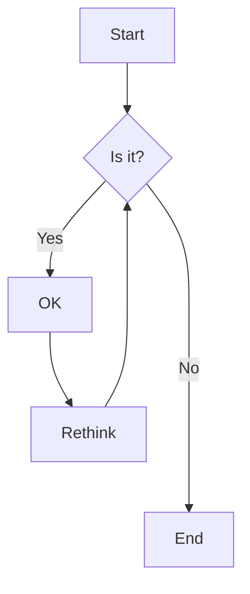
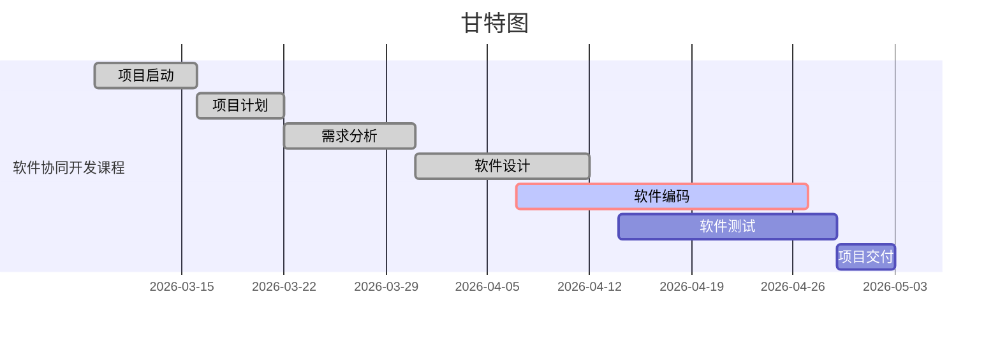
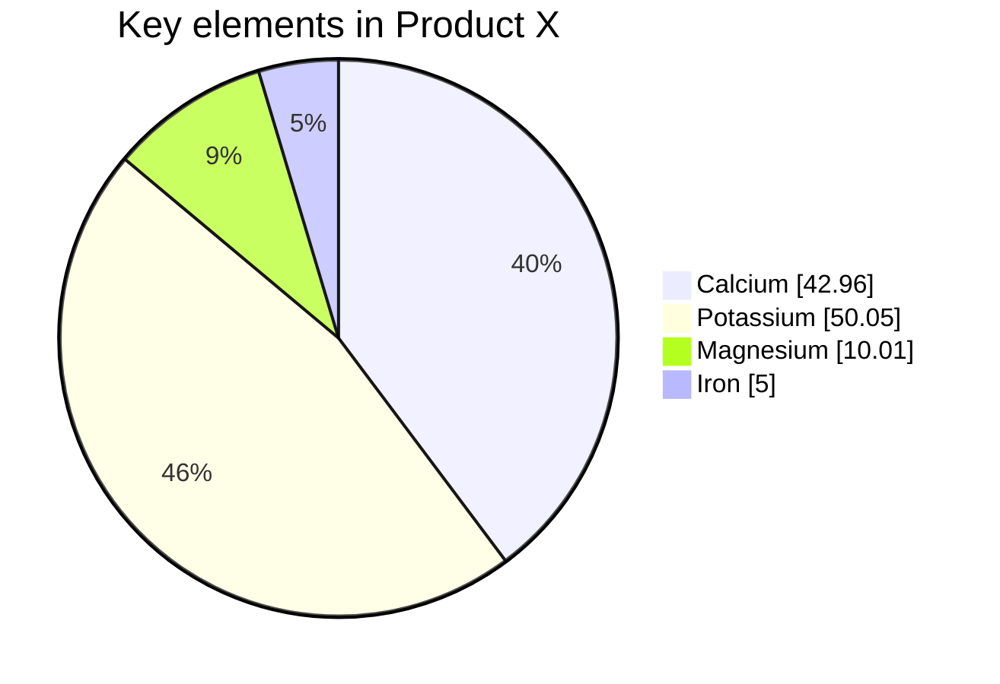

#### mermaid

```mermaid
flowchart TD
    A[Start] --> B{Is it?}
    B -->|Yes| C[OK]
    C --> D[Rethink]
    D --> B
    B ---->|No| E[End]
```

```mermaid
gantt
title 甘特图
dateFormat MM-DD
section 软件协同开发课程
项目启动 :done,des1,03-09,7d
项目计划 :done,des2,after des1,6d
需求分析 :done,des3,after des2,9d
软件设计 :done,des4,after des3,12d
软件编码 :crit,active,des5,04-07,20d
软件测试 :des6,04-14,15d
项目交付 :des7,after des6,4d
```

```mermaid
pie showData
    title Key elements in Product X
    "Calcium" : 42.96
    "Potassium" : 50.05
    "Magnesium" : 10.01
    "Iron" :  5
```