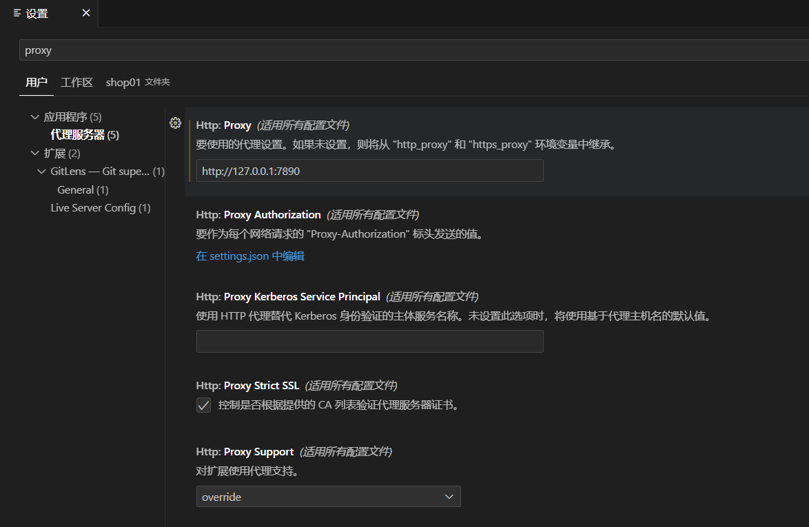

# 笔记模式

## 介绍

- 编辑工具：VSCode
- 版本管理：GitHub
- 输入辅助：GitHub Copilot、ChatGPT
- 笔记格式：MarkDown
- 思维导图：MindMap

## ChatGPT

- 解答问题
- 优化代码
- 修复报错
- 生成MarkDown

## Copilot

> 根据上下文，自动联网生成补充内容

- Alt+\：行内建议代码
- Alt+]：切换建议代码
- ctrl+enter：打开提示面板选用10个意见代码中的一个

## MarkDown

- 记录笔记内容
- 生成MindMap
- 生成HTML页面
- 生成目录（可跳转）

## MindMap

> 根据思路，汇总笔记，全局预览，查漏补缺

---

## 学习路径

> 所有知识学习的过程对应不同的阶段如下（Bloom的分类法）：

- **基础**
  - **记忆**：承认或记住事实，术语，基本概念或答案，而不必理解其含义。
  - **理解**：通过解释，分类，总结，推论，比较和解释来解释主要思想和概念并表达意义。
  - **应用**：通过应用获得的知识，事实，技术和规则来解决新情况下的问题。使用知识来解决问题，确定事物之间的联系以及它们在新情况下的应用方式。
- **进阶**
  - **分析**：检查信息并将其分解为组成部分，确定各部分之间的关系，确定动机或原因，进行推断，并找到支持概括的证据。包括：元素分析、关系分析、组织分析。
  - **评价**：评估涉及通过基于一组标准对信息，想法的有效性或工作质量进行判断来提出和捍卫意见。其特点包括：内部证据方面的判断、外部标准的判断。
  - **创造**：创建涉及将元素放在一起以形成一个连贯的或功能完整的整体。创建包括通过计划将元素重新组织为新的样式或结构。

---

## 其他

### 解决 GitHub Copilot 无法使用的问题

1. 浏览器插件 Ghelper 中购买VIP，下载 Clash for Windows 客户端
2. 运行 Clash 后配置git代理：

``` JavaScript
git config --global http.proxy http://127.0.0.1:7890
git config --global https.proxy http://127.0.0.1:7890
```

若仍然无法使用GitHub Copilot，则需为Vscode配置代理


取消代理

``` JavaScript
git config --global --unset http.proxy
git config --global --unset https.proxy
```

### VSCode 插件

使用 VSCode 插件，实现 Markdown、MindMap 的实时预览

- Markdown Mind Map Preview
- Markdown All in One
